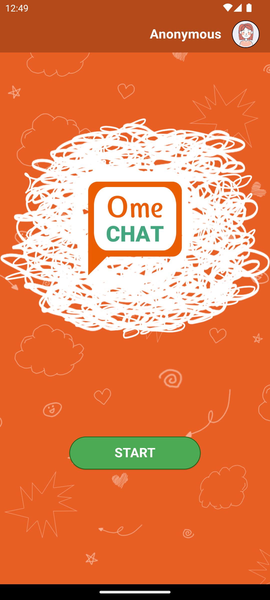
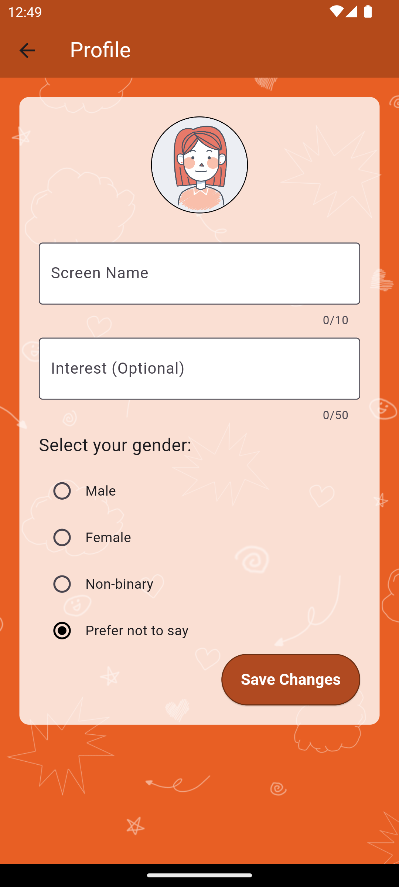
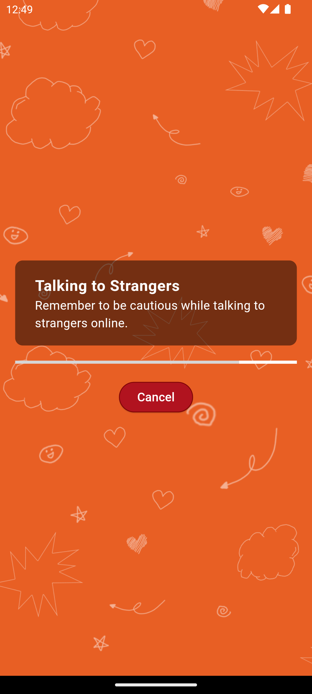
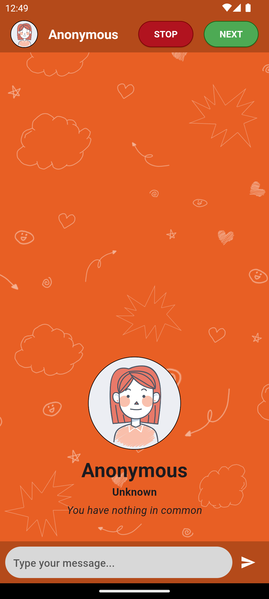

# OmeChat

## About

An Omegle-inspired mobile app built with Flutter and Firebase.

## Demo

### Home Screen

### Profile Screen

### Loading Screen

### Chat Screen

## Installation

1. Download the latest APK from the [Releases](https://github.com/chstrkn/OmeChat/releases) section of this repository.
2. On your Android device, go to **Settings > Security**.
3. Enable **Unknown sources** to allow the installation of apps from sources other than the Play Store.
4. Locate the downloaded APK file and tap on it to install.

## Running the App

After installation, you can find the app icon in your device's app drawer. Tap on it to launch the app.
